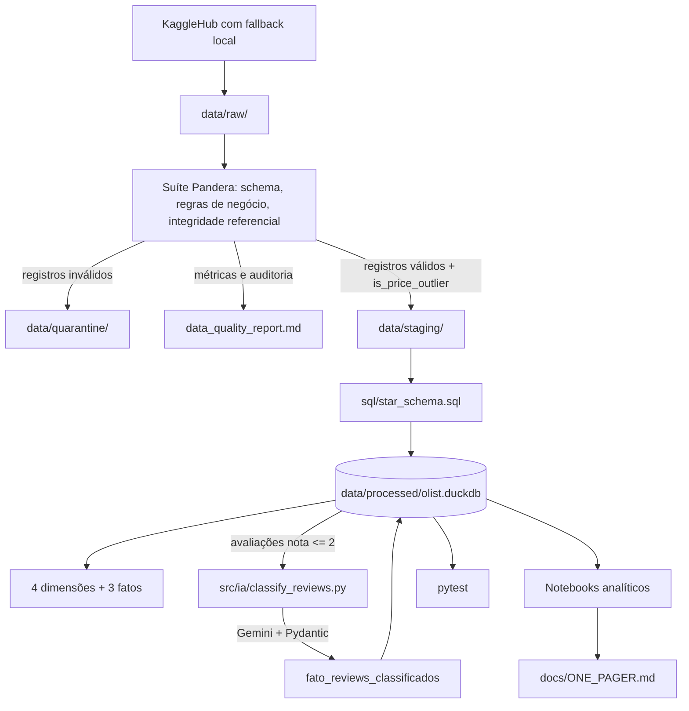
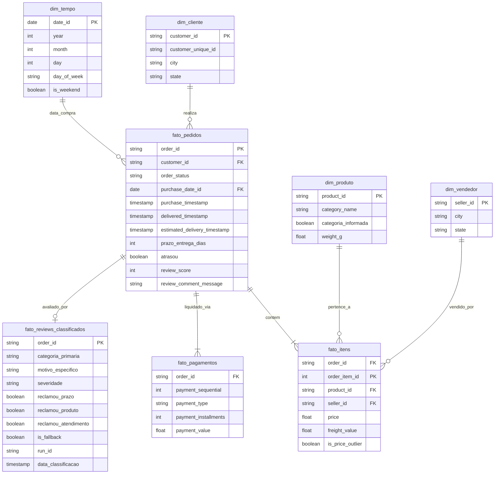

# Estudo de Caso Olist — Case PS Analista BI PL iFood

Transformação dos dados brutos do marketplace Olist em recomendação de receita para a diretoria, cobrindo modelagem dimensional, governança de qualidade, pipeline reprodutível, análise estatística e processamento de linguagem natural.

**Pergunta central:** *"Quais são as alavancas mais efetivas para aumentar a receita nos próximos 6 meses?"*

**Resposta em uma linha:** três alavancas somando **+R$ 530 mil a +R$ 707 mil** por semestre (+9,6% a +12,8% sobre o run-rate de R$ 5,51M), detalhadas em [`docs/ONE_PAGER.md`](docs/ONE_PAGER.md).

---

## 1. Como executar

**Pré-requisitos:** Python 3.10+. Chave da API do Google Gemini apenas para o módulo de IA.

```bash
python -m venv venv
# Windows:      .\venv\Scripts\activate
# Linux/macOS:  source venv/bin/activate
pip install -r requirements.txt
```

**Todos os comandos abaixo rodam a partir da raiz do projeto, na sua IDE, com o diretório aberto.**

**Pipeline de dados** — ingestão, qualidade e modelagem dimensional:


```bash
python -m src.etl.main
```

Gera `data/staging/`, `data/quarantine/`, o banco `data/processed/olist.duckdb` e o relatório [`data_quality_report.md`](data_quality_report.md). O banco versionado no repositório permite abrir os notebooks sem executar a ingestão, caso não haja credencial do Kaggle disponível.

**Testes:**

```bash
python -m pytest tests/ -v
```

São 9 testes, e cada um trava uma decisão registrada na [ADR](docs/ADR.md) — grão do pedido, integridade entre as fatos, quarentena por chave, sinalização de outlier — em vez de perseguir cobertura.

**Módulo de IA** (opcional — consome cota de API). Configure `API_KEY=sua_chave` em um arquivo `.env` e execute:

```bash
python -m src.ia.classify_reviews
```

Recria a tabela `fato_reviews_classificados` no DuckDB. Confira no log que nenhum lote caiu em fallback antes de citar os percentuais da taxonomia.

**Notebooks:** `jupyter notebook`
>Recomenda-se a instalação da extensão do Jupyter na sua IDE (Jupyter *by Microsoft*) para melhor execução e visualização.

| Notebook | Conteúdo |
|:---|:---|
| [`analise_exploratoria.ipynb`](notebooks/analise_exploratoria.ipynb) | Profiling do DW: volumetria, distribuições, concentração geográfica, composição do pedido |
| [`analise_requerida_case.ipynb`](notebooks/analise_requerida_case.ipynb) | As 5 perguntas de negócio da Etapa 4 |
| [`analise_alavancas.ipynb`](notebooks/analise_alavancas.ipynb) | Memória de cálculo das 3 alavancas |
| [`analise_dados_ia.ipynb`](notebooks/analise_dados_ia.ipynb) | Diagnóstico de causa-raiz das avaliações negativas |

---

## 2. Arquitetura

Camadas no padrão Medallion, adaptado para execução analítica local sem dependência de serviços externos.



| Módulo | Responsabilidade |
|:---|:---|
| `src/etl/main.py` | Orquestrador: garante os dados brutos, aciona a validação, materializa o banco |
| `src/dq/validators.py` | Schemas Pandera, quarentena, sinalização de outlier, auditoria e relatório de DQ |
| `sql/star_schema.sql` | DDL/DML que lê `staging/` e materializa dimensões e fatos |
| `src/ia/classify_reviews.py` | Descoberta de taxonomia e classificação semântica persistida no DW |

---

## 3. Modelagem dimensional

O layout que o Mermaid renderiza é hierárquico, mas a topologia é estrela: as fatos se conectam às dimensões conformadas, sem relacionamento entre dimensões.



**Volumetria:** 99.441 clientes · 3.095 vendedores · 32.951 produtos · 98.816 pedidos · 112.108 itens · 103.222 pagamentos.

### Decisões de granularidade

**Três fatos em vez de uma.** Um pedido pode ter vários itens e vários pagamentos — há casos com até 29 transações. Uma tabela única multiplicaria linhas e duplicaria `SUM(price)` e `SUM(payment_value)`. Separando por grão, cada análise usa a fato correta: receita e produto em `fato_itens`, parcelamento em `fato_pagamentos`, ciclo de entrega e satisfação em `fato_pedidos`.

**O filtro de cancelados vale para as três fatos.** `fato_pedidos` exclui `order_status = 'canceled'`, e `fato_itens` e `fato_pagamentos` propagam a exclusão por `EXISTS`. Sem isso ficariam 542 itens e 664 pagamentos órfãos, R$ 95 mil de GMV cancelado entrando em qualquer consulta feita direto sobre `fato_itens`, e a relação identificante do ERD sendo violada pelos próprios dados.

**Deduplicação de avaliações pela mais recente.** 551 pedidos têm mais de uma avaliação e 202 têm notas divergentes. O desempate usa `ROW_NUMBER()` sobre `review_creation_date`, trazendo nota e comentário da mesma linha — evita enviesar a satisfação para cima e subestimar os detratores, justamente a população que alimenta o módulo de IA.

**Métricas de prazo derivadas no modelo, não em cada consulta.** `prazo_entrega_dias` e `atrasou` são calculadas uma vez no `star_schema.sql`. O motivo é mais que conveniência: 8 pedidos têm status `delivered` sem data de entrega, e escrever a pontualidade como `CASE WHEN delivered > estimated THEN 'atraso' ELSE 'no prazo' END` classificaria esses 8 como pontuais sem qualquer sinal de erro. Na coluna derivada, a ausência de data resulta em `NULL`, que não satisfaz nem `atrasou = TRUE` nem `atrasou = FALSE` — o pedido sai de toda métrica de prazo por construção. O mesmo princípio motiva `dim_produto.categoria_informada`: os 610 produtos sem categoria continuam visíveis como `unknown`, mas o filtro para excluí-los de um ranking de categorias é explícito em vez de depender de alguém escrever a comparação com a string certa.

**`dim_tempo` gerada no banco** via `generate_series`, cobrindo 2016 a 2019, sem arquivo estático de calendário.

---

## 4. Qualidade de dados

Suíte em Pandera com política de **soft fail**: anomalias são segregadas em `data/quarantine/` com a coluna `quarantine_reason`, e a esteira nunca é interrompida. O relatório [`data_quality_report.md`](data_quality_report.md) é emitido a cada execução com resultado **PASS/FAIL** por verificação.

### Verificações com descarte

| Entidade | Regra | Tratamento |
|:---|:---|:---|
| Clientes, Vendedores, Produtos | Unicidade da chave primária | Quarentena |
| Pedidos | Unicidade de `order_id` | Quarentena |
| Pedidos | `delivered_date >= purchase_date` | Quarentena |
| Itens | `price >= 0` e `freight_value >= 0` | Quarentena |
| Pagamentos | Boleto exige `installments = 1` | Quarentena |
| Avaliações | `review_score` entre 1 e 5 | Quarentena |
| Integridade referencial | 6 relacionamentos (pedidos→clientes, itens→pedidos, itens→produtos, itens→vendedores, pagamentos→pedidos, avaliações→pedidos) | Órfãos para quarentena |

### Anomalias auditadas sem descarte

Nem toda inconsistência justifica descartar a linha. Estas são registradas no relatório e resolvidas na modelagem:

| Anomalia | Ocorrências | Tratamento |
|:---|---:|:---|
| Itens com preço atípico | 3 | Sinalizados com `is_price_outlier`, mantidos |
| Avaliações duplicadas | 551 | Desempate pela mais recente |
| Pedidos com notas divergentes | 202 | Prevalece a mais recente |
| `delivered` sem data de entrega | 8 | Mantidos; `atrasou` fica `NULL` e os exclui das métricas de prazo |
| Produtos sem categoria | 610 | Normalizados como `unknown`, com flag `categoria_informada` |

**Sobre a detecção de outlier de preço.** Preço de e-commerce é aproximadamente log-normal (assimetria 7,95 nesta base), um fence padrão sobre a escala linear (`Q3 + 3×IQR`) cortaria em R$ 419,90 e classificaria como outlier 4.074 itens: 3,6% das linhas, mas **24,9% do GMV**, com mediana de R$ 659. Isso não é erro de lançamento, é o catálogo de móveis, eletrodoméstico e informática da plataforma. O fence é calculado sobre `ln(price)`, o que move o corte para ~R$ 5.200 e isola apenas o extremo real (3 itens). A ação é sinalização, não expurgo: preço alto é fato comercial, e excluí-lo é decisão da análise, não da ingestão. Detalhamento na [ADR-04](docs/ADR.md).

---

## 5. As 5 perguntas de negócio

### 5.1 Sazonalidade

Crescimento consistente até o primeiro semestre de 2018. **Novembro de 2017 é o maior mês de toda a série** (7.421 pedidos, R$ 1,00M), a Black Friday. Janeiro mostra a desaceleração pós-festas e as compras se concentram em dias úteis (77,0% contra os 71,4% que cinco de sete dias representariam).

Uma observação metodológica que vale registrar: agregar por número do mês somando os anos produz um artefato grosseiro. A base cobre setembro de 2016 a setembro de 2018, então janeiro–agosto aparecem com dois anos de dados e setembro–dezembro com um. Nesse recorte, novembro — o maior mês real — aparece *abaixo* de maio. O notebook apresenta a série temporal e a sazonalidade normalizada pela cobertura, que são perguntas diferentes.

### 5.2 Categorias mais rentáveis

Lideram o GMV: *health_beauty* (9,4%), *watches_gifts* (9,0%), *bed_bath_table* (7,8%), *sports_leisure* (7,4%) e *computers_accessories* (6,8%). A dinâmica difere: *bed_bath_table* vende volume com ticket moderado, enquanto *watches_gifts* e *musical_instruments* têm preço médio por item acima de R$ 200 — é onde o parcelamento estendido tem efeito.

### 5.3 Impacto do prazo de entrega na recompra

Pedidos entregues no prazo levaram 10,8 dias em média; os atrasados, 31,5 dias. Clientes cuja primeira entrega atrasou recompram 2,50% contra 3,05% dos pontuais, e o Qui-Quadrado rejeita a independência (**p = 0,0083**).

**Mas o efeito vale 0,55 ponto percentual**, e a nota da avaliação praticamente não move a recompra, a taxa fica entre 2,7% e 3,1% de 1 a 5 estrelas, com nota 4 recomprando menos que nota 1. Com 97% de compradores únicos, esta base não sustenta alavanca de retenção: mesmo zerando todos os 4.008 atrasos de um semestre, o efeito preservaria cerca de 22 clientes. Significância estatística e magnitude relevante são coisas distintas, e a distinção mudou o desenho da Alavanca 2.

### 5.4 CLV por macro-região

Com 97% de compradores únicos o dataset não sustenta um CLV no sentido próprio, não há ciclo de vida observável. Calculamos o gasto acumulado decomposto em ticket × frequência × retenção, agrupado em 5 macro-regiões porque as 27 UFs produziam médias instáveis.

| Região | Clientes | Ticket médio | Frequência | Retenção (meses) | Recompra |
|:---|---:|---:|---:|---:|---:|
| Norte | 1.786 | R$ 225,51 | 1,03 | 1,08 | 2,74% |
| Nordeste | 9.107 | R$ 202,45 | 1,03 | 1,04 | 2,37% |
| Centro-Oeste | 5.575 | R$ 178,42 | 1,03 | 1,05 | 3,05% |
| Sul | 13.634 | R$ 163,37 | 1,03 | 1,07 | 2,95% |
| Sudeste | 65.480 | R$ 151,60 | 1,04 | 1,07 | 3,16% |

Norte e Nordeste têm os maiores tickets, mas frequência e retenção são idênticas em todas as regiões. O ticket mais alto não é sinal de cliente mais fiel: são compras maiores para diluir frete elevado. Há apetite de consumo que a fricção logística limita, o diagnóstico que sustenta a Alavanca 3.

### 5.5 Concentração de vendedores

**17,7% dos vendedores (540 de 3.056) geram 80% da receita**; 4,2% já respondem pela metade. O outro lado é uma cauda improdutiva: 1.686 vendedores (55%) transacionaram menos de 10 itens em dois anos e somam 8,1% do GMV. São Paulo concentra 60% dos lojistas, contra demanda distribuída pelo país.

---

## 6. Módulo de IA

Pipeline de NLP integrado ao DW, em duas fases:

1. **Descoberta de taxonomia.** O modelo recebe uma amostra aleatória com semente fixa e propõe de 4 a 6 categorias mutuamente exclusivas. Categorias definidas a priori carregam viés de confirmação e tendem a não cobrir o que os clientes escrevem.
2. **Classificação estruturada.** Lotes de 50 avaliações com *structured output* validado por Pydantic: `categoria_primaria`, `motivo_especifico`, `severidade` e três flags booleanas. O resultado é materializado em `fato_reviews_classificados`, virando dimensão consultável em SQL.

**Por que o módulo existe.** Dois terços dos clientes que dão nota 1 ou 2 receberam o pedido no prazo. Para esses 8.127 pedidos — R$ 1,32M de GMV — nenhuma métrica operacional explica a insatisfação. Só o texto explica. É o que torna a classificação um instrumento de diagnóstico, e não uma demonstração de LLM.

**Salvaguardas.** Um lote cuja chamada à API falhe entra como `nao_classificado` com `is_fallback = TRUE`, e é excluído de qualquer percentual — atribuir a esses registros uma categoria real da taxonomia os tornaria indistinguíveis de inferência real. A tabela é recriada por execução e carrega `run_id`, porque a taxonomia é redescoberta a cada rodada e misturar execuções produziria uma média de taxonomias incompatíveis. Os notebooks declaram o tamanho da amostra e a margem de erro junto de cada percentual.

---

## 7. Recomendação ao CEO

Base de comparação: **R$ 5,51 milhões**, o faturamento de 2018-S1, último semestre completo. Usar a média histórica de R$ 3,31M inflaria o crescimento aparente em 67%, porque embute a fase de rampa da plataforma. O mesmo recorte vale para as bases de cada projeção: volume de pedidos à vista, GMV exposto e GMV por vendedor local saem todos de 2018-S1, para que numerador e denominador descrevam o mesmo período.

| # | Alavanca | Ganho semestral | Sobre a base |
|:-:|:---|---:|---:|
| 1 | Parcelamento sem juros em até 10x | +R$ 231k a 347k | +4,2% a 6,3% |
| 2 | Curadoria de sortimento por causa-raiz | +R$ 175k | +3,2% |
| 3 | Ativação de vendedores locais no N/NE | +R$ 123k a 185k | +2,2% a 3,4% |
| | **Total** | **+R$ 530k a 707k** | **+9,6% a 12,8%** |

Duas premissas de negócio entram no cálculo e estão declaradas onde são usadas: conversão de 8% a 12% dos compradores à vista na Alavanca 1 e recuperação de 30% do GMV exposto na Alavanca 2. O restante deriva de dado observado. O documento completo está em [`docs/ONE_PAGER.md`](docs/ONE_PAGER.md).

---

## 8. Estrutura do repositório

```
case_ifood/
├── data/
│   ├── raw/                      # CSVs brutos (KaggleHub ou local)
│   ├── staging/                   # CSVs validados pela suíte de DQ
│   ├── quarantine/                # Registros segregados pelo soft fail
│   └── processed/olist.duckdb     # Data Warehouse dimensional (versionado)
├── docs/
│   ├── ADR.md                     # Registro de decisões de arquitetura
│   ├── ONE_PAGER.md               # Recomendação executiva
│   └── proposta_case/             # Enunciado do case
├── notebooks/
│   ├── analise_exploratoria.ipynb
│   ├── analise_requerida_case.ipynb
│   ├── analise_alavancas.ipynb
│   └── analise_dados_ia.ipynb
├── sql/star_schema.sql
├── src/
│   ├── dq/validators.py
│   ├── etl/main.py
│   └── ia/classify_reviews.py
├── tests/
│   ├── test_etl.py                # Tabelas, chaves, grão do pedido, integridade entre fatos
│   ├── test_dq.py                 # Quarentena por chave e sinalização de outlier
│   └── test_ia.py                 # Contratos Pydantic e persistência
├── data_quality_report.md         # Gerado pelo pipeline
├── requirements.txt
└── README.md
```

---

## 9. Decisões de arquitetura

As escolhas técnicas relevantes estão registradas em [`docs/ADR.md`](docs/ADR.md), organizadas em 6 decisões: modelagem em Star Schema, a separação em quatro fatos com propagação de filtros entre elas, o framework de qualidade de dados com soft-fail, a detecção de outlier de preço em escala logarítmica, a engine local (DuckDB em vez de dbt) com ingestão resiliente, e o escopo e desenho do módulo de IA.
